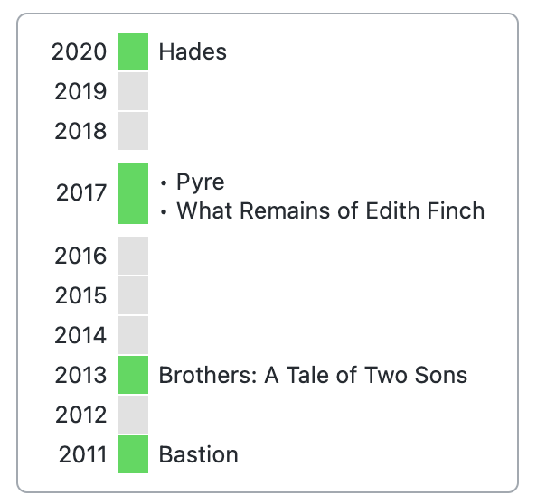
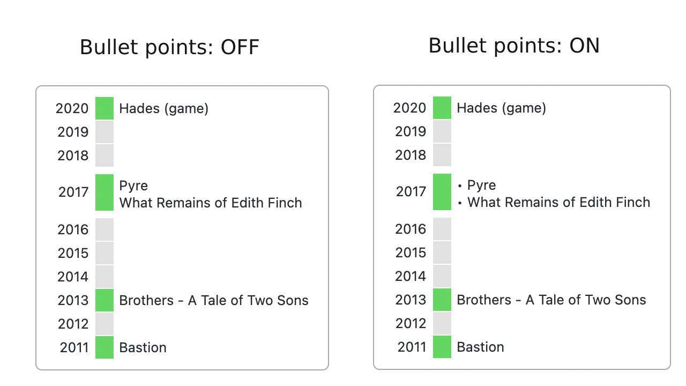

# Release Timeline for Obsidian

A release timeline inspired by the [Wikipedia timeline of release years](https://en.wikipedia.org/wiki/Template:Timeline_of_release_years).

This plugin works only with [Obsidian Dataview](https://github.com/blacksmithgu/obsidian-dataview) installed.



## How to use

### 1. Populate information about the year in note metadata.

Plugin will automatically extract the year from the provided date.
Different date formats are supported, including: `2022`, `2022-12-31`, `2022-12`, `31/12/2022`.


### 2. Create a `release-timeline` codeblock to create a timeline.

Release Timeline uses syntax compatible with [Obsidian Dataview](https://github.com/blacksmithgu/obsidian-dataview), which should be familiar to existing Dataview users.

Any **query written for Release Timeline** should also be a **valid Dataview query**, so you can change the codeblock type to `dataview` at any point to check the returned results.

Query example:
~~~markdown
```release-timeline
table 
release_year
from [[CRPG]] and [[Isometric games]]
sort desc
```
~~~

Query elements:
- `table` - (optional) may be present in the beginning of each query for compatibility with Dataview.
- `field_name` - name of the field in the notes metadata containing the year or date. `release_year` in the example above.
- `from ...` - conditions defining the notes that will be used to build the timeline. Syntax is the same as in Dataview.
- `sort (asc|desc)` - (optional) sort order of the items in the timeline. If not provided, the default order from plugin settings will be used (desc by default).

## Options
- **Default sort order**
  - If `sort` is not provided in the query block, sort order selected in settings will be used (ascending or descending).

- **Collapse empty years**
  - When enabled, collapses multiple consecutive empty years into one.
  - With 'Collapse empty years limit' it's possible to specify the minumum number of consecutive years to be collapsed.
  - 

- **Bullet points**
  - Shows bullet points for years with multiple items.
  - 

## Known issues
1. If a note with the release timeline codeblock is opened when Obsidian starts, it will not be rendered. Switch to another note and back to view the timeline.
2. Chaning settings other than 'Bullet points' will not re-render the timeline. Switch to another note and back to view the updated timeline.
